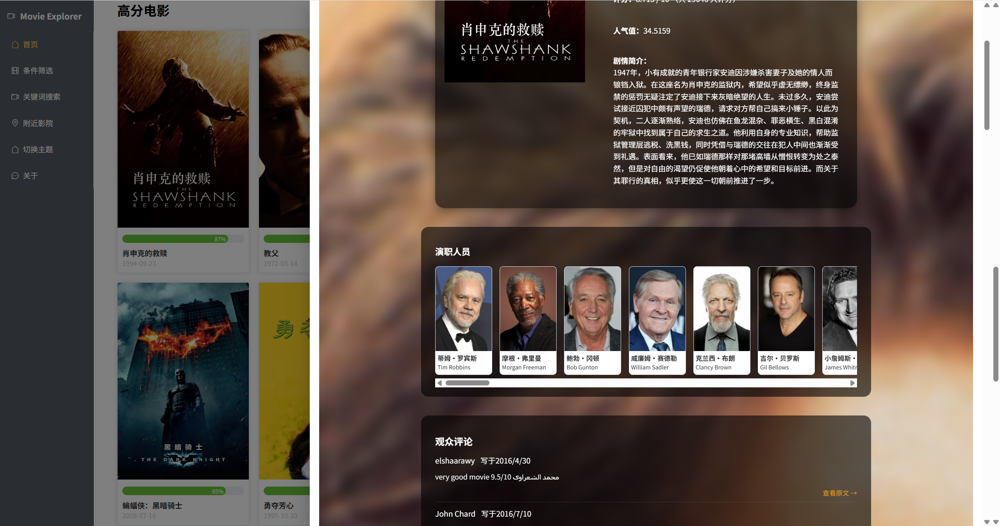

# 电影检索&附近影院查看平台


## 一、项目背景

随着在线电影数据库和票务服务的日益普及，用户经常需要在多个平台之间切换，才能找到合适的电影、查看评分、查找附近的电影院以及查看天气是否适合外出。

本项目完成了一个电影检索网站，可以获取各种各样的电影信息，支持条件筛选和关键词搜索，还可以获取周围的影院信息。

## 二、功能说明

#### 1. 网站首页


#### 2. 条件筛选


#### 3. 关键搜索


#### 4. 电影详细



#### 5. 附近影院


## 三、项目设计

### 1. 项目结构

```
src
├─api
│  ├─getCinemaInfo
│  ├─getMovieInfo
│  ├─getWeatherInfo
│  └─responsePanel
├─assets
│  └─images
├─components
│  ├─CinemaInfo
│  ├─HeaderNavbar
│  ├─MovieDetail
│  ├─TempChart
│  └─WeatherForecast
├─router
├─stores
├─styles
└─views
    ├─AboutUsPage
    ├─FilterByConditions
    ├─MovieFrontPage
    ├─NearbyCinemaPage
    └─SearchByKeyword
```

### 2. 项目实现

#### (1) 核心功能实现

* 1. **电影信息检索与展示**

    * 首页默认调用 TMDB 的 Discover Movie API 与 Movie List API，获取 “正在热映” 电影数据，展示电影海报、评分、上映日期等关键信息，支持 “换一批” 功能刷新数据。

    * 关键词搜索功能：监听搜索框输入，触发 TMDB 的 Search Movie API，根据电影标题模糊匹配结果，实时更新页面列表；同时支持点击电影卡片跳转至详情页。

    * 电影详情页：通过路由参数获取电影 ID，调用 TMDB 的 Movie List（传入电影 ID）与 Movies Credits、Movies Reviews API，展示剧情简介、演职人员、用户评分、人气值等详细信息。

* 2. **条件筛选功能**

    * 筛选维度设计：涵盖 “电影类型”（动作、冒险、动画等 16 类）、“发行日期”（开始 / 结束月份选择）、“用户评分”（7-10 分等区间）、“时长”（0-240 分钟）、“最少投票人数”（默认 0 人）5 个核心维度。

    * 逻辑处理：用户选择筛选条件后，Pinia 存储当前筛选参数，点击 “GO” 按钮时，将参数拼接为 TMDB Discover Movie API 的请求参数，发起请求并更新电影列表；筛选条件支持 “重置”（恢复默认值），满足用户重新筛选的需求。

* 3. **附近影院与天气联动**

    * 影院信息获取：调用高德地图 Search POI API，传入用户当前定位（或默认 “上海嘉定区”），筛选 “影院” 类型的 POI 数据，获取影院名称、详细地址、商家电话、评分、营业时间等信息，在地图上标记位置并列表展示。

    * 天气信息辅助：调用高德地图 Weather Forecast API，获取当前区域（如上海嘉定区）的实时温度、风向风力、未来多日天气，为用户判断 “是否适合外出观影” 提供参考，且页面实时显示天气更新时间（如 2025-10-21 17:31:42）。

#### (3) API 调用与处理

* 项目依赖 TMDB 和高德地图两类外部 API，通过统一的请求管理确保数据稳定获取：

* **API 密钥配置：** 在 env.d.ts 中定义环境变量，存储 TMDB API Key 与高德地图 Key，避免密钥硬编码；同时在 .gitignore 中排除环境配置文件，保障密钥安全。

* **错误处理机制：** 针对 API 调用失败场景（如文档 7、8 中 “INVALID_USER_KEY” 错误），在 Axios 响应拦截器中捕获错误码，页面显示 “数据加载失败，请重试” 提示；若 TMDB API 返回无结果，展示 “未找到匹配电影” 的空状态页面。

* **数据格式转换：** 将 API 返回的原始数据（如时间戳、英文类型名）转换为用户友好格式，例如将 TMDB 的 “release_date” 转换为 “2025-07-24” 格式，将高德 API 的 “business_hours” 拆分为 “今日营业” 与 “完整时间” 展示。

#### (4) 特点

* **组件化开发：** 将页面拆分为 HeaderNavbar（导航栏）、MovieDetail（电影详情）、CinemaInfo（影院信息）、WeatherForecast（天气预告）等可复用组件，降低代码耦合度，便于后续维护与功能扩展。

* **状态管理优化：** 通过 Pinia 模块化管理状态，例如 “筛选条件” 单独作为一个 Store，避免不同页面间的状态混乱；同时利用 Pinia 的持久化存储，刷新页面后保留用户之前选择的筛选条件。

* **响应式适配：** 页面采用流式布局与媒体查询，适配电脑、平板等不同屏幕尺寸，确保 “电影列表”“影院地图” 等模块在不同设备上均能正常显示，提升用户体验。

## 附录：使用到的API

| API              | URL                                                        | Description                                                  |
| ---------------- | ---------------------------------------------------------- | ------------------------------------------------------------ |
| Discover Movie   | https://api.themoviedb.org/3/discover/movie                | Find movies using over 30 filters and sort options.          |
| Movie List       | https://api.themoviedb.org/3/movie/{movie_type}            | Get different kinds of movies.                               |
| Movies Credits   | https://api.themoviedb.org/3/movie/{movie_id}/credits      | Get the credits for a movie.                                 |
| Movies Reviews   | https://api.themoviedb.org/3/movie/{movie_id}/reviews      | Get the user reviews for a movie.                            |
| Search Movie     | https://api.themoviedb.org/3/search/movie                  | Search for movies by their titles.                           |
| Search POI       | https://restapi.amap.com/v5/place/around?parameters        | Search for movies by their titles.                           |
| Weather Forecast | https://restapi.amap.com/v3/weather/weatherInfo?parameters | Get the weather forecast.                                    |
