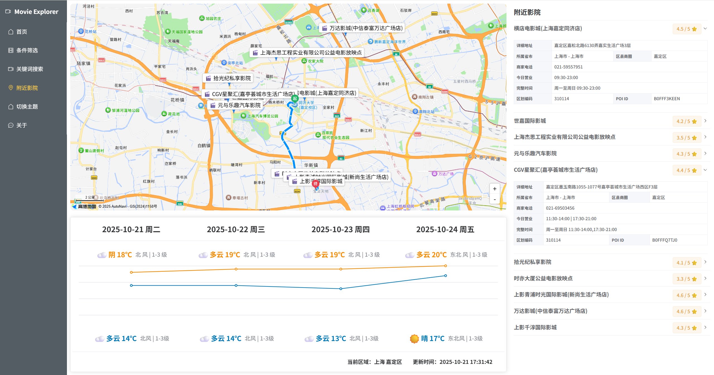

## Movie_Explorer

2025 同济大学 微服务架构个人项目

### 1. 项目简介

一个电影检索网站，可以获取各种各样的电影信息，支持条件筛选和关键词搜索，还可以获取周围的影院信息

项目中用到的接口的主要来源：

1. [The Movie Database (TMDB)](https://developer.themoviedb.org/docs/getting-started)

2. [高德Web服务](https://lbs.amap.com/api/webservice/summary)

3. [高德地图服务](https://lbs.amap.com/api/javascript-api-v2/summary)

### 2. 项目展示

#### 网站首页


#### 条件筛选


#### 关键搜索


#### 电影详细


#### 附近影院



### 3. 启动程序

```sh
npm install
npm run dev
```
